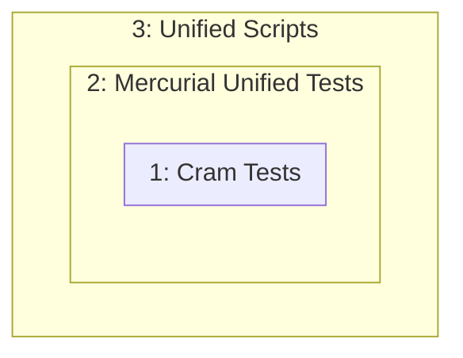

# Unified scripts

<!-- Generated by UCramRunner in <MlFront>/src/UnifiedScript_Top -->
<!-- Rendered into Markdown and Markdoc with <MlFront>/../dune monorepo -->

## Intro

Unified scripts combine input and output in the same document in a
readable format (*"literate programming"*).

Commands are *marked into* a document with two spaces and a prompt.
For example, we can have the command `echo Hello World` marked into
a Markdown document with `<SPACE> <SPACE> $ <SPACE>`:

```unified
# My Markdown Document
We'll run the "echo" command.

  $ echo Hello World
```

The power of unified scripts is that they are both readable documents *and* runnable scripts.
Running the script above creates an update that
includes the output of the `echo` command:

```unified
# My Markdown Document
We'll run the "echo" command.

  $ echo Hello World
  Hello World
```

Every line in a unified script is either:

- the main document (Markdown in the example above)
- a mark-in command
- a mark-in response to a command

In fact, several kinds of main documents can be unified scripts.

Depending on the kind of main document, after a unified script is run, the mark-in command and responses should be *rendered* to produce a prettier main document.
For Markdown main documents, the commands and responses are prettier if they are wrapped in code blocks:

    # My Markdown Document
    We'll run the "echo" command.

    ```sh
      $ echo Hello World
      Hello World
    ```

You can use the following main document guides for more information, including how to do pretty rendering:

|              |                 |
| ------------ | --------------- |
| [Plain Text] | [AsciiDoc]      |
| [Markdown]   | [OCaml Modules] |
| [Typst]      |                 |

[Plain Text]: #plain-text
[Markdown]: #markdown
[AsciiDoc]: #asciidoc
[Typst]: #typst
[OCaml Modules]: #ocaml-modules
[mark-in kind]: #mark-in-kinds
[mark-in executables]: #executables

## Main Document Kinds

### Plain Text

| Filename extension | Notes                                                |
| ------------------ | ---------------------------------------------------- |
| `.MARKIN.u`        | `MARKIN` is the file extension of the [mark-in kind] |

Plain text means there is no rendering post-processing step.

Steps:

1. Run the `MARKIN` executable from the [mark-in executables] table. You will not need a renderer.

### Markdown

| Filename extension | Notes                                                |
| ------------------ | ---------------------------------------------------- |
| `.md.MARKIN.u`     | `MARKIN` is the file extension of the [mark-in kind] |

For Markdown documents, avoid Markdown indented code blocks. Those indented code blocks might be mistaken for unified command prompts.

Steps:

1. Run the `MARKIN` executable from the [mark-in executables] table. You will not need a renderer.
2. Run the `U2Markup` executable from the [mark-in executables] table, which will convert your Markdown unified script into a prettified Markdown.

> [!IMPORTANT]
> Unified scripts require that lines starting with `<SPACE> <SPACE> <SOME PROMPT>`
> are not present in your main Markdown document.
> So wrap the shell commands and their output in fenced code
> blocks; do not use indented code blocks.

### OCaml Modules

| Filename extension | Notes |
| ------------------ | ----- |
| `.ml`              |       |

Ordinary OCaml module files can be used **without any special markup**.
However, the [toplevel module expressions](https://ocaml.org/manual/5.4/modules.html)
in the OCaml module file must be formatted. In particular:

- the toplevel module expressions must start at column 1
- the first word (ex. ["let"], ["module"], ["open"], etc.) of each toplevel module
  expression must be followed by an ASCII space (0x20). No other whitespace is allowed.

`ocamlformat` conforms to the formatting requirements.

When run as a unified script, each toplevel module expression is run through the OCaml
toplevel interpreter.
Here is an `ocamlformat`-ed OCaml module that has not been run as a unified script:

```ocaml
let lyrics =
  "Everybody step to the left."

let (_ : string) =
  Printf.sprintf "Now let's sing: %s" lyrics

module UnifiedShowExample =
  struct
  let contents () = "This is the contents of the module!"
end
```

After running as a unified script (see *Steps* below), OCaml comments are added to
both **top-level `let` expressions** and **modules prefixed with `UnifiedShow`**:

```ocaml
let lyrics =
  "Everybody step to the left."
  (* val lyrics : string = "Everybody step to the left." *)[@ocamlformat "disable"]

let (_ : string) =
  Printf.sprintf "Now let's sing: %s" lyrics
  (* - : string = "Now let's sing: Everybody step to the left." *)[@ocamlformat "disable"]

module UnifiedShowExample =
  struct
  let contents () = "This is the contents of the module!"
end
  (* - : string = "This is the contents of the module!" *)[@ocamlformat "disable"]
```

Steps:

1. Run the `UMlModuleRunner` from the [mark-in executables] table. You will not need a renderer.
   The generated OCaml comments are indented which messes up formatters like `ocamlformat`.
   Use `--disable-ocamlformat` to disable ocamlformat for each command response.

### Typst

| Filename extension | Notes                                                |
| ------------------ | ---------------------------------------------------- |
| `.typ.MARKIN.u`    | `MARKIN` is the file extension of the [mark-in kind] |

> [!WARNING]
> Typst documents have not been tested.

### AsciiDoc

| Filename extension | Notes                                                |
| ------------------ | ---------------------------------------------------- |
| `.adoc.MARKIN.u`   | `MARKIN` is the file extension of the [mark-in kind] |

> [!WARNING]
> AsciiDoc main documents have not been tested.

## Mark-in Kinds

The precise prompt and continuation/terminator is determined by the *kind*
(the file extension) of unified script:

| Kind                            | Prompt | Multiline          | Runs                |
| ------------------------------- | ------ | ------------------ | ------------------- |
| Cram test `.t`                  | `$`    | `>`                | POSIX shell command |
| Mercurial test (dormant; `.t`)  | `$`    | `>`                | POSIX shell command |
|                                 | `>>>`  | `...`              | Python              |
| OCaml unified cram test `.ml.u` | `#`    | `;;`               | OCaml expression    |
|                                 | `>>>`  | `...`              | OCaml expression    |
| OCaml module test `.mlm.u`      | `#`    | `;;`               | OCaml expression    |
|                                 | `>>>`  | `...`              | OCaml expression    |
| `dk` build script `.dk.u`       | `$`    | `>`                | Build shell command |
|                                 | `%`    | *end of Lua chunk* | Lua command         |

### Cram Tests

The **cram test** is the most widely supported unified script format across the industry, but it has the least features.

Mercurial [invented this format for their test scripts](https://web.archive.org/web/20101023031400/http://www.selenic.com/blog/?p=663).
[Bitheap (Python)](https://bitheap.org/cram/) and
[Dune (OCaml)](https://dune.readthedocs.io/en/stable/reference/cram.html)
adopted the format and called their scripts {b cram tests}.

| Kind           | Prompt | Multiline | Runs                |
| -------------- | ------ | --------- | ------------------- |
| Cram test `.t` | `$`    | `>`       | POSIX shell command |

```cramtest
Run any shell command:

  $ echo Twas brillig, and the slithy toves
  > did gyre and gimble in the wabe;
  > All mimsy were the borogoves,
  > And the mome raths outgrabe.
  Twas brillig, and the slithy toves
  did gyre and gimble in the wabe;
  All mimsy were the borogoves,
  And the mome raths outgrabe.

Errors will be reported:

  $ hg this-does-not-exist
  hg: 'this-does-not-exist' is not a hg command. See 'hg --help'.
```

### Mercurial Unified Tests

Mercurial later added support for inline Python code and multiline commands:

```python
Some Python code can be run as part of the test:

   >>> from datetime import date
   >>> print(date(2020, 1, 1))
   2020-01-01

Split the command across multiple lines if needed:
   >>> for i in range(3):
   ...     print(i)
   0
   1
   2
```

Bitheap (Python cram tests) and Dune (OCaml cram tests) did not adopt the `>>>`
prompt.

| Kind                           | Prompt | Multiline | Runs                |
| ------------------------------ | ------ | --------- | ------------------- |
| Mercurial test (dormant; `.t`) | `$`    | `>`       | POSIX shell command |
|                                | `>>>`  | `...`     | Python              |

### dk Build Scripts

Three extra requirements in the `dk0` build tool led to the full unified
script syntax.

- *Arbitrary languages*: Where cram tests allowed one language (shell) and
  Mercurial unified tests allowed two languages (shell and Python), there
  was a need for two different languages (Lua and a variation of
  PowerShell/POSIX shell) with a third reserved for future use.
- *Section headings*: There was a need to document and assign meaning to
  sections of each script. Markdown is commonplace, so ATX headings (lines
  beginning with one or more "#") were a natural choice for section
  headings.
- *Output metadata*: Metadata in the output makes it possible to render
  the output differently based on the tags. For example, when rendering a
  unified script in Markdown, the code blocks should be rendered with the
  correct highlighting language (ex. Lua syntax highlighting for `%`
  code blocks).

The full unified script syntax satisfies the three requirements.

| Kind                      | Prompt | Multiline          | Runs                |
| ------------------------- | ------ | ------------------ | ------------------- |
| `dk` build script `.dk.u` | `$`    | `>`                | Build shell command |
|                           | `%`    | *end of Lua chunk* | Lua command         |

```unified
## CommonsBase_Build.Apparatus@0.1.0

Bundle a small CMake project in the hello-src/ directory
using the Lua command "unified.asset"
  % unified.asset { name="HelloWorld", dir="hello-src" }
  \dkasset
  '790'
  { 'sha256:847c39531962e987ba69983babf15f244735f3d566d4fdcaa9a94c038484415d' }

Run the "post-object" shell command to build HelloWorld
with CMake
  $ post-object CommonsBase_Build.CMake0.F_Build@3.25.3 -d t/o/somewhere/
  > assetmodver=CommonsBase_Build.Apparatus.HelloWorld@0.1.0 assetpath=hw
  > gargs[]=-DCMAKE_BUILD_TYPE=Release
  > bargs[]=--config bargs[]=Release
  > iargs[]=--config iargs[]=Release
  > outexe[]=bin/hello
  \pass\;object:oor4kvp5hp7wtwtzfba2ayfhpanwjyhxnsryjssyr5nxt5zslkycq:OurCMake_F_Build.Xhmcju4uhjoh54b35k3iobgdz4q@1.0.0
```

## Syntax

There are three revisions of the unified syntax. Each revision is a subset
of the next revision.



The unified syntax is:

- Lines beginning with two spaces, a prompt (ex. `$` for cram tests), and a space are run.
- Lines beginning with two spaces, a continuation (ex. `>` for cram tests), and a space introduce
  the second, third and beyond lines in a multi-line command.
  - Alternatively, multi-line commands can end with a terminator (ex. `;;` for OCaml)
  - Alternatively, multi-line commands can end if the language has rules to know what a statement is complete (ex. Lua chunks)
- All other lines beginning with two spaces are considered command output.
- Output lines ending with a space and the keyword `(re)` are matched as
  regular expressions *if* a regular expression matcher is provided in the
  configuration (not configured today!).
- Lines ending with a space and the keyword `(glob)` are matched with a
  glob-like syntax *if* a glob matcher is provided in the configuration (not configured today!).
  The only special characters supported are `*` and `?`. Both characters
  can be escaped using `\`, and the backslash can be escaped itself.
- Output lines ending with either of the above keywords are always first
  matched literally with actual command output.
- Lines ending with a space and the keyword `(no-eol)` will match actual
  output that doesn't end in a newline.
- Actual output lines containing unprintable characters are escaped and
  suffixed with a space and the keyword `(esc)`. Lines matching
  unprintable output must also contain the keyword.
- Anything else is the main document.

## Other

> [!Tip]
> Each update captures the behavior of the script commands.
> Put the updates into source control (ex. `git`) and you have a persistent
> record of how the behavior changed.

Unified scripts are not limited to just running shell commands.
In fact, there are several different kinds of unified scripts.

A `.ml.u` unified script runs OCaml toplevel commands (the same
ones an OCaml developer would run in `/usr/bin/ocaml` or `opam exec -- ocaml`).
Here are some simple OCaml expressions that have been rendered into Markdown with syntax highlighting:


```ocaml
(* # *) let _ = 2 + 4 ;;
```


```text
- : int = 6
```


```ocaml
(* >>> *) let _ =
   let x = "hello" in
   let y = "world" in
   x ^ y
```


```text
- : string = "helloworld"
```


If you looked directly in the `.ml.u` script ... the file you edit ... you would see:

```
   # let _ = 2 + 4 ;;
   - : int = 6

   >>> let _ =
   ...    let x = "hello" in
   ...    let y = "world" in
   ...    x ^ y
   - : string = "helloworld"
```

A `.dk.u` unified script runs Lua and shell build commands:

```unified
## CommonsBase_Build.Apparatus@0.1.0

Bundle a small CMake project in the hello-src/ directory
using the Lua command "unified.asset"
  % unified.asset { name="HelloWorld", dir="hello-src" }
  \dkasset
  '790'
  { 'sha256:847c39531962e987ba69983babf15f244735f3d566d4fdcaa9a94c038484415d' }

Run the "post-object" shell command to build HelloWorld
with CMake
  $ post-object CommonsBase_Build.CMake0.F_Build@3.25.3 -d t/o/somewhere/
  > assetmodver=CommonsBase_Build.Apparatus.HelloWorld@0.1.0 assetpath=hw
  > gargs[]=-DCMAKE_BUILD_TYPE=Release
  > bargs[]=--config bargs[]=Release
  > iargs[]=--config iargs[]=Release
  > outexe[]=bin/hello
  \pass\;object:oor4kvp5hp7wtwtzfba2ayfhpanwjyhxnsryjssyr5nxt5zslkycq:OurCMake_F_Build.Xhmcju4uhjoh54b35k3iobgdz4q@1.0.0
```

> [!NOTE]
> You don't see the above `.dk.u` code rendered because this documentation is
> rendered from a `.ml.u` (OCaml only) unified script.

## Unified Ecosystem

### Executables

| Executable        | Description                                            |
| ----------------- | ------------------------------------------------------ |
| `UCramRunner`     | Runs `.ml.u` scripts with OCaml mark-ins               |
| `UMlModuleRunner` | Runs `.mlm.u` scripts with OCaml mark-ins              |
| `U2Markdown`      | Renders commands and responses as Markdown code blocks |

### OCaml Users

You can install the [executables](#executables) using opam:

```sh
opam install UnifiedScript_Std UnifiedScript_Top
```

You can also use the bleeding edge:

```sh
opam pin add UnifiedScript_Std https://gitlab.com/dkml/build-tools/MlFront/-/releases/permalink/downloads/MlFront.tar.gz

opam pin add UnifiedScript_Top https://gitlab.com/dkml/build-tools/MlFront/-/releases/permalink/downloads/MlFront.tar.gz
```

### Supporting a new Mark-in Kind

> [!NOTE]
> TODO: Document how to extend the ecosystem using `UnifiedScript_Std`
